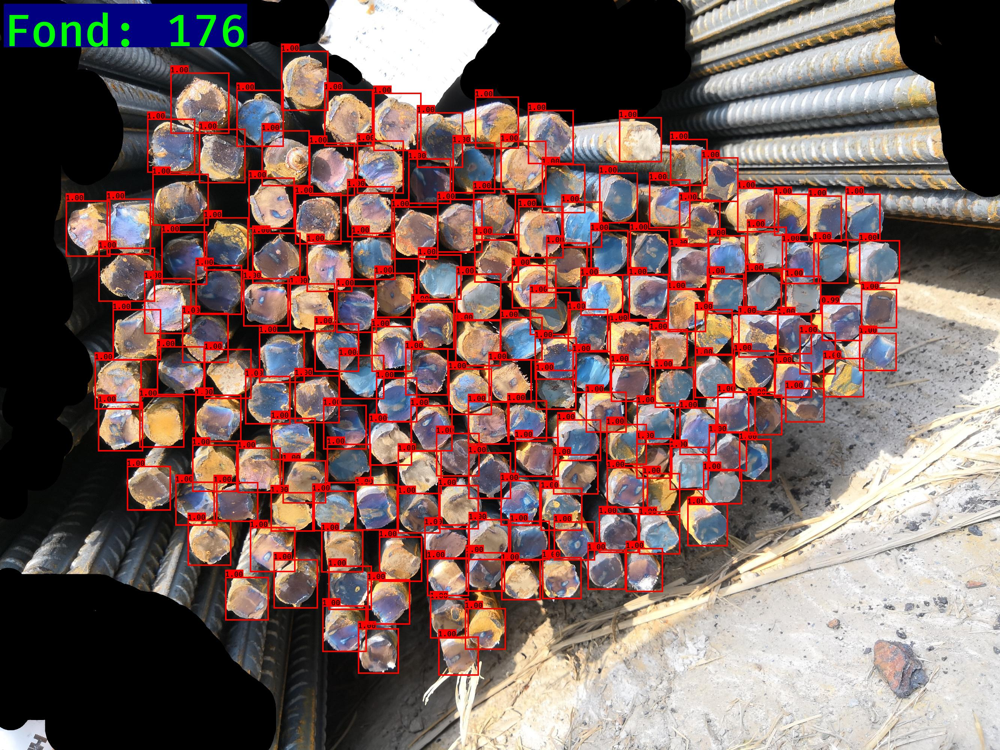

简介
----

[智能盘点—钢筋数量AI识别项目](https://www.datafountain.cn/competitions/332)

背景:在工地现场，对于进场的钢筋车，验收人员需要对车上的钢筋进行现场人工点根，确认数量后钢筋车才能完成进场卸货。目前现场采用人工计数的方式，上述过程繁琐、消耗人力且速度很慢（一般一车钢筋需要半小时，一次进场盘点需数个小时）。针对上述问题，希望通过手机拍照->目标检测计数->人工修改少量误检的方式智能、高效的完成此任务.

准备工作
----
1. Yolo预训练数据下载:

    1). 利用迅雷下载yolo.h5文件 : https://pjreddie.com/media/files/yolov3.weights
    
    2). 格式转换: python convert.py yolov3.cfg yolov3.weights model_data/yolo_weights.h5
    
    3). cp yolo_weights.h5 model/yolo_weights.h5
    
    
2. 根据具体情况修改配置文件:
    
    1). 如果有需要,就先修改配置文件yolo3.cfg，搜索"yolo"关键词，能搜到三处包含"yolo"的地方，修改filters(在相邻的[convolutional]层)、classes和random(在[yolo]层)。
    
        具体地, 在每一处yolo之前的那个convolutional层都要修改filters的数目,filters=anchors_num*(classes_num + 5),anchors_num为3（一般不变）, classes_num为3（根据这个修改就行）,修改yolo中classes的数目。注意是每个yolo和yolo前的convolutional层都做相同的修改, random为多尺度训练,1为打开多尺度训练，0为相反。
    
    2). 修改model_data下coco_classes.txt和voc_classes.txt，里面写的是要识别的类型，此处写rebars。
    
    
```
用法
-------
1. cd rebars
    #2. python csv_label.py      # 将官网提供的训练标签数据data/train_labels.csv, 转换为符合Labelimg软件可查看的xml格式, 存储在data.train_Annotations位置
    #3. python splitdata.py      # 数据切分, 在data/splitset文件夹下生成4个txt文件
    #4. python voc_annotation.py # 在当前目录下生成train.txt, trainval.txt, val.txt和test.txt
    
2. python csv_voc_annotation.py  # 将官网提供的训练标签数据data/train_labels.csv, 转换为符合Labelimg软件可查看的xml格式, 存储在data.train_Annotations位置
                                 # 同时在当前文件夹下生成tain.txt文件,
                                   
3. python train.py          # 训练模型,结果保存为logs/trained_weights.h5
4. python detect.py         # 利用训练的结果对data/test_dataset中的图片进行检测, 结果保存在data/detect下

```

